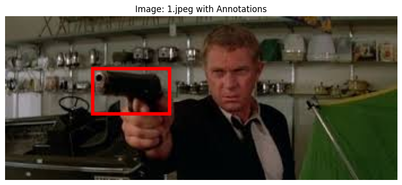

# Gun Detection Lab

## **Background**

In recent years, gun-related violence has become a significant concern for law enforcement agencies and communities worldwide. Detecting firearms in images or videos can play a crucial role in preventing crimes, enhancing surveillance systems, and ensuring public safety. Object detection models, such as Faster R-CNN, have proven to be effective tools for identifying and localizing objects like guns in visual data.

This lab introduces you to the basics of computer vision and object detection using PyTorch. You will build a gun detection system using a pre-trained Faster R-CNN model fine-tuned on a custom dataset containing annotated images of guns.

This lab is a modified version of Gun Detect project hosted by [Kaggle](https://www.kaggle.com/code/sibtainali110/guns-fasterrcnn-detection)

## **Goal**

The goal of this lab is to:

1. Understand R-CNN, Fast R-CNN, and Faster R-CNN
2. Train a Faster R-CNN model to detect guns in images.
3. Evaluate the model's performance using metrics such as precision, recall, and F1-score.
4. Test the trained model on custom images to visualize its predictions.

By the end of this lab, you will have a working gun detection system that can identify and localize firearms in static images.

---

## **Dataset**

### **Source**

The dataset used in this lab is available at (an original and a backup copy):

- [https://www.kaggle.com/code/sibtainali110/guns-fasterrcnn-detection](https://github.com/frankwxu/AI4DigitalForensics/blob/main/lab02_Gun_detection_fasterRCNN/data/data.7z)

- [https://github.com/frankwxu/AI4DigitalForensics/blob/main/lab02_Gun_detection_fasterRCNN/data/data.7z](https://github.com/frankwxu/AI4DigitalForensics/blob/main/lab02_Gun_detection_fasterRCNN/data/data.7z)

### **Structure**

The dataset contains the following folders:

1. **Images**: Contains JPEG images with guns.
2. **Labels**: Contains text files with bounding box annotations in Pascal VOC format:

```Python
<number_of_guns>
xmin ymin xmax ymax
```

- The first line specifies the number of guns in the image.
- Each subsequent line contains the bounding box coordinates `(xmin, ymin, xmax, ymax)` for a single gun.

3. **our_test_images (Optional)**: A folder containing custom test images for evaluating the trained model.

## Preprocessing

The annotations are parsed into bounding boxes and labels, where:

- All objects are labeled as `1` (Gun).
- Background regions are labeled as `0`.

An example training image with annotations



## R-CNN and Fast R-CNN Algorithm

- The R-CNN (Region-based Convolutional Neural Network) algorithm is a foundational object detection technique in computer vision. You MUST watch [R-CNN Tutorial](https://www.youtube.com/watch?v=nJzQDpppFj) first

- [Fast R-CNN](https://www.youtube.com/watch?v=5gAq6BZ87aA&t=1454s) is an object detection algorithm that significantly improved upon the original R-CNN (Region-based Convolutional Neural Network) by addressing its speed limitations. Fast R-CNN processes the entire input image through the CNN only once This significantly reduces redundant computations.

## Faster R-CNN Algorithm

[Faster R-CNN](https://www.youtube.com/watch?v=auHkGHM-x_M) is an object detection algorithm that builds upon Fast R-CNN, addressing its primary remaining bottleneck: the region proposal generation. It integrates the region proposal network (RPN) directly into the network, making it significantly faster and more efficient.

Faster R-CNN is a two-stage object detection model:

1. **Region Proposal Network (RPN)**: Proposes candidate regions of interest (RoIs) in the image.
2. **Classification and Regression Head**: Classifies the RoIs and refines their bounding box coordinates.

### Why Faster R-CNN?

- **Accuracy**: Faster R-CNN achieves high accuracy for detecting small or occluded objects like guns.
- **Transfer Learning**: By leveraging a pre-trained backbone (ResNet-50 + FPN), the model performs well even with smaller datasets.

### The Architecture of Faster R-CNN


## Training Process

### Steps

1. **Load Dataset**:

   - The `GunDataset` class loads images and parses annotations from the `Images` and `Labels` folders.
   - Data augmentation (e.g., random horizontal flip) is applied during training.

2. **Model Initialization**:

   - A pre-trained Faster R-CNN model (`torchvision.models.detection.fasterrcnn_resnet50_fpn`) is loaded.
   - The classifier head is replaced to support two classes: `Background` and `Gun`.

3. **Training Loop**:

   - The model is trained for 10 epochs using the SGD optimizer.
   - Losses (classification and regression) are computed and backpropagated.

4. **Save Model**:
   - The trained model is saved as `gun_detection_model.pth`.

### Code Snippet

```python
# Train for 10 epochs
num_epochs = 10
for epoch in range(num_epochs):
    print(f"Epoch {epoch}/{num_epochs}")
    train_one_epoch(model, optimizer, train_loader, device, epoch)
```

## Testing and Evaluation Process

### Testing

1. **Load Pre-trained Model**:

   - The saved model (`gun_detection_model.pth`) is loaded for inference.
   - Alternatively, a pre-trained model can be downloaded from Dropbox:

2. **Predict on Custom Images**:

- The model predicts bounding boxes and confidence scores for guns in images from the `our_test_images` folder.
- Predictions with confidence scores above a threshold (e.g., 0.5) are visualized.

### Evaluation

1. **Metrics**:

- Precision, recall, and F1-score are computed using the `classification_report` function from `sklearn.metrics`.
- Intersection over Union (IoU) is used to match predicted bounding boxes with ground truth boxes.

2. **Visualization**:

- Images with annotated bounding boxes are displayed using `matplotlib`.

### Code Snippet

```python
# Evaluate the model
evaluate_model(model, test_loader, device)

# Test on custom images
predict_custom_images(model, custom_test_images_dir, get_transform(train=False))
```

## Usage Instructions

### Setup

1. **Install dependencies**:

   ```bash
   pip install torch torchvision matplotlib opencv-python pycocotools pyy7zr requests

   ```

2. **Download and extract the dataset**:

   ```python
   !wget -O /content/data.7z https://github.com/frankwxu/AI4DigitalForensics/raw/main/lab02_Gun_detection
   !py7zr x /content/data.7z /content/dataset
   ```

3. Run the notebook cells sequentially to:
   - Train the model.
   - Save the trained model.
   - Test the model on custom images.

### Testing

To test the model on custom images:

1. Place your test images in the `our_test_images` folder.
2. Run the `predict_custom_images` function to visualize predictions.

## Expected Outputs

1. **Training Logs**:

```
Epoch 1/10, Iteration 0, Loss: 0.5200
```

2. **Evaluation Metrics**:

```Python
Classification Report:
precision       recall      f1-score    support
Background      0.95        0.98        0.96      500
Gun             0.90        0.85        0.87      500
accuracy                                0.92     1000
```

3. **Custom Prediction**:

- A plot of the test image with bounding boxes around detected guns.

## Conclusion

This lab demonstrates how to build a gun detection system using PyTorch and Faster R-CNN. By leveraging transfer learning and a custom dataset, you can achieve high accuracy in detecting and localizing firearms in images. This project can be extended for real-time applications, such as video surveillance or embedded systems.

For questions or feedback, feel free to reach out!
